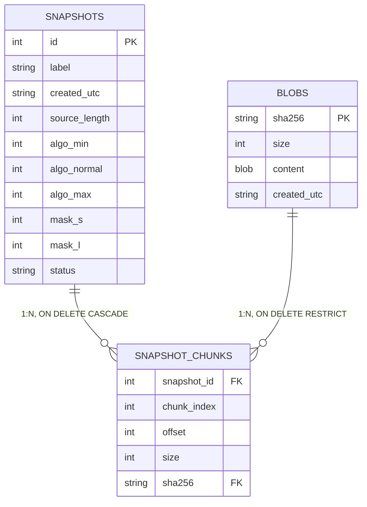
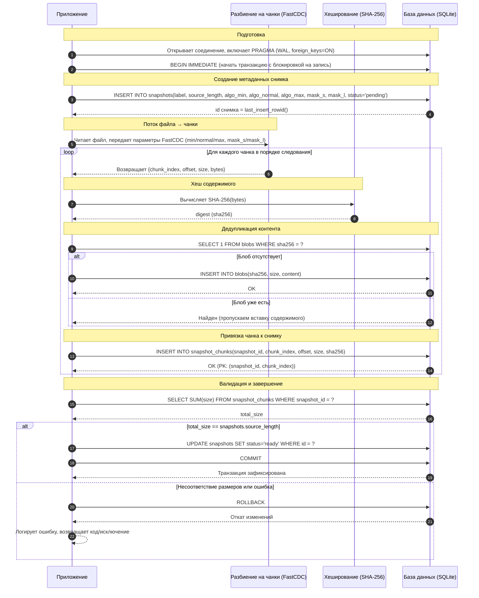
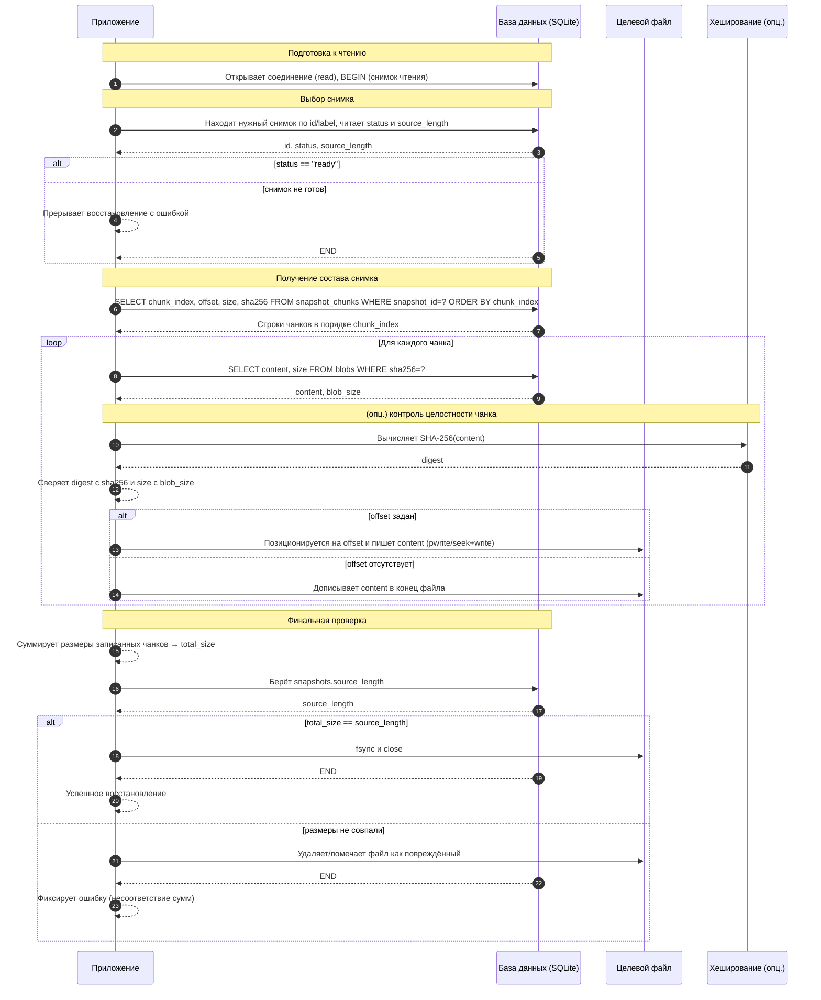

# Схемы базы данных для хранения снимков (фрагментов)

## Структура базы данных

```mermaid
erDiagram
  %% Композитный PK у SNAPSHOT_CHUNKS: (snapshot_id, chunk_index)

  SNAPSHOTS {
    int    id PK
    string label
    string created_utc
    int    source_length
    int    algo_min
    int    algo_normal
    int    algo_max
    int    mask_s
    int    mask_l
    string status
  }

  BLOBS {
    string sha256 PK
    int    size
    blob   content
    string created_utc
  }

  SNAPSHOT_CHUNKS {
    int    snapshot_id FK
    int    chunk_index
    int    offset
    int    size
    string sha256 FK
  }

  %% Связи и поведение внешних ключей
  SNAPSHOTS ||--o{ SNAPSHOT_CHUNKS : "1:N, ON DELETE CASCADE"
  BLOBS     ||--o{ SNAPSHOT_CHUNKS : "1:N, ON DELETE RESTRICT"
```

## Схема последовательности записи в базу данных

```mermaid
sequenceDiagram
    autonumber
    participant APP as Приложение
    participant CH as Разбиение на чанки (FastCDC)
    participant HS as Хеширование (SHA-256)
    participant DB as База данных (SQLite)

    Note over APP,DB: Подготовка
    APP->>DB: Открывает соединение, включает PRAGMA (WAL, foreign_keys=ON)
    APP->>DB: BEGIN IMMEDIATE (начать транзакцию с блокировкой на запись)

    Note over APP,DB: Создание метаданных снимка
    APP->>DB: INSERT INTO snapshots(label, source_length, algo_min, algo_normal, algo_max, mask_s, mask_l, status='pending')
    DB-->>APP: id снимка = last_insert_rowid()

    Note over APP,CH: Поток файла → чанки
    APP->>CH: Читает файл, передает параметры FastCDC (min/normal/max, mask_s/mask_l)
    loop Для каждого чанка в порядке следования
        CH-->>APP: Возвращает {chunk_index, offset, size, bytes}

        Note over APP,HS: Хеш содержимого
        APP->>HS: Вычисляет SHA-256(bytes)
        HS-->>APP: digest (sha256)

        Note over APP,DB: Дедупликация контента
        APP->>DB: SELECT 1 FROM blobs WHERE sha256 = ?
        alt Блоб отсутствует
            APP->>DB: INSERT INTO blobs(sha256, size, content)
            DB-->>APP: OK
        else Блоб уже есть
            DB-->>APP: Найден (пропускаем вставку содержимого)
        end

        Note over APP,DB: Привязка чанка к снимку
        APP->>DB: INSERT INTO snapshot_chunks(snapshot_id, chunk_index, offset, size, sha256)
        DB-->>APP: OK (PK: (snapshot_id, chunk_index))
    end

    Note over APP,DB: Валидация и завершение
    APP->>DB: SELECT SUM(size) FROM snapshot_chunks WHERE snapshot_id = ?
    DB-->>APP: total_size
    alt total_size == snapshots.source_length
        APP->>DB: UPDATE snapshots SET status='ready' WHERE id = ?
        APP->>DB: COMMIT
        DB-->>APP: Транзакция зафиксирована
    else Несоответствие размеров или ошибка
        APP->>DB: ROLLBACK
        DB-->>APP: Откат изменений
        APP-->>APP: Логирует ошибку, возвращает код/исключение
    end
```

## Схема последовательности восстановления из базы данных

```mermaid
sequenceDiagram
    autonumber
    participant APP as Приложение
    participant DB as База данных (SQLite)
    participant FS as Целевой файл
    participant HS as Хеширование (опц.)

    Note over APP,DB: Подготовка к чтению
    APP->>DB: Открывает соединение (read), BEGIN (снимок чтения)

    Note over APP,DB: Выбор снимка
    APP->>DB: Находит нужный снимок по id/label, читает status и source_length
    DB-->>APP: id, status, source_length
    alt status == "ready"
    else снимок не готов
        APP-->>APP: Прерывает восстановление с ошибкой
        DB-->>APP: END
    end

    Note over APP,DB: Получение состава снимка
    APP->>DB: SELECT chunk_index, offset, size, sha256 FROM snapshot_chunks WHERE snapshot_id=? ORDER BY chunk_index
    DB-->>APP: Строки чанков в порядке chunk_index

    loop Для каждого чанка
        APP->>DB: SELECT content, size FROM blobs WHERE sha256=?
        DB-->>APP: content, blob_size

        Note over APP,HS: (опц.) контроль целостности чанка
        APP->>HS: Вычисляет SHA-256(content)
        HS-->>APP: digest
        APP-->>APP: Сверяет digest с sha256 и size с blob_size

        alt offset задан
            APP->>FS: Позиционируется на offset и пишет content (pwrite/seek+write)
        else offset отсутствует
            APP->>FS: Дописывает content в конец файла
        end
    end

    Note over APP,DB: Финальная проверка
    APP-->>APP: Суммирует размеры записанных чанков → total_size
    APP->>DB: Берёт snapshots.source_length
    DB-->>APP: source_length
    alt total_size == source_length
        APP->>FS: fsync и close
        DB-->>APP: END
        APP-->>APP: Успешное восстановление
    else размеры не совпали
        APP->>FS: Удаляет/помечает файл как повреждённый
        DB-->>APP: END
        APP-->>APP: Фиксирует ошибку (несоответствие сумм)
    end
```
